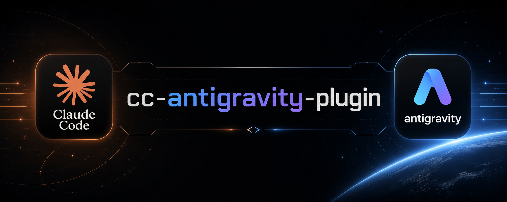

<p align="center">
  
</p>

# cc-antigravity-plugin

Plugin para Claude Code e Codex que integra o [Antigravity CLI (AGY)](https://antigravity.google) como assistente de codificação agêntico — cria, edita, pesquisa arquivos e executa comandos autonomamente sobre sua base de código.

📖 **Documentação em outras línguas:**
- [English](./README.md)

> **Fork:** Este plugin é um fork do [gemini-cli-plugin](https://github.com/google-gemini/gemini-cli), originalmente criado por [thepushkarp](https://www.linkedin.com/in/thepushkarp) para automação de processos com Gemini CLI.

## Visão Geral

O AGY é um terminal CLI do Google com janela de contexto longa (2M tokens). Este plugin conecta o AGY ao Claude Code e ao Codex por meio de um bridge Node.js compartilhado, expondo o AGY como um endpoint [tool_use](https://www.anthropic.com/research/tool-use) que Claude pode invocar.

**Quando usar em vez do Claude Code nativo:**
- Refatorações multi-arquivo que precisam de contexto amplo do repositório
- Geração de código que atravessa várias camadas do projeto
- Análise de arquitetura e impacto de mudanças com contexto completo
- Tarefas que se beneficiam dos modelos Gemini Pro de raciocínio profundo
- Tarefas com múltiplos entregáveis independentes que podem rodar em paralelo via subagentes Gemini nativos (`--parallel`)

### Claude invocando `agy` diretamente vs via plugin

O Claude pode chamar `agy` diretamente via Bash (`agy --print "task" --dangerously-skip-permissions --add-dir .`) sem nenhuma camada intermediária. O plugin, porém, entrega capacidades que o `agy` bruto não consegue:

| Capacidade | `agy` direto | Via plugin (bridge) |
|---|---|---|
| Seleção de modelo headless | `--model` nativo | Catálogo runtime, aliases, cache de 24 horas e fallback seguro |
| Comportamento de coding agent garantido | Não — AGY tende a responder texto | Sim — bloco `<constraints>` instrui uso de `write_to_file`, `grep_search`, etc. |
| Sinais estruturados de quota/auth | Envelope JSON | Exit codes 10/11 + sinal JSON normalizado com conversa/uso |
| Ingestão automática de arquivos | Manual | `--dirs`, `--files` com detecção binária e truncamento |
| Parallelismo via subagentes Gemini | Manual | `--parallel` + progresso NDJSON opcional (`--format stream-json`) |
| Fallback do limite de 28k chars (Windows) | Quebra silencioso | Drop automático de arquivos inline |
| Logging auditável | Não | JSONL em `%LOCALAPPDATA%\agy\cc-plugin-logs\` |
| Overhead de processo | Nenhum | Child process assíncrono; ConPTY só em `--interactive` |
| Visibilidade das ações do AGY | Total — output direto | Caixa preta — Claude não valida antes de executar |
| Dependência de quota | Só Claude | Claude + AGY/Gemini |

**Resumo:** para workflows automatizados, skills e tarefas de codificação onde o comportamento agêntico consistente é necessário, o bridge é a escolha correta. Para invocações ad-hoc simples, o `agy` bruto é suficiente.

## Migração para a versão 4.0

A versão 4.0 requer AGY 1.1.8+ e realinha as flags do bridge com a CLI:

- `--agent` agora exige um nome (`--agent code-reviewer`). Use `--interactive`
  para uma sessão PTY; o comportamento antigo de alias foi removido.
- O modo headless usa JSON e desativa slash commands por padrão. Use `--format text`
  ou `--allow-slash-commands` para reativar os comportamentos anteriores.
- Modelos passam pela flag nativa `--model`; o bridge nunca edita `settings.json`.
- `--generate-image` usa a tool `generate_imagem` e não inventa mais o slug
  de modelo `nano-banana`.

## Pré-requisitos

- **Node.js 18+**
- **Antigravity CLI 1.1.8+** instalado e autenticado (AGY 1.1.16 recomendado)

```bash
# macOS / Linux
curl -fsSL https://antigravity.google/cli/install.sh | bash

# Windows PowerShell
irm https://antigravity.google/cli/install.ps1 | iex
```

Após instalar, rode `agy` uma vez para fazer login e confirme que está funcionando:

```bash
agy --print "what is 2+2"
```

> O hook `SessionStart` verifica automaticamente se o AGY está instalado e acessível a cada início de sessão do Claude Code.

## Instalação

### Claude Code (recomendado)

**Via CLI (terminal):**

```bash
# Adiciona o repositório GitHub como fonte de marketplace
claude plugin marketplace add AllanHarlen/cc-antigravity-plugin

# Instala o plugin
claude plugin install cc-antigravity-plugin@AllanHarlen/cc-antigravity-plugin
```

**Via slash command (dentro do Claude Code):**

```
/plugin marketplace add AllanHarlen/cc-antigravity-plugin
/plugin install cc-antigravity-plugin@AllanHarlen/cc-antigravity-plugin
```

**Para testar uma cópia local do repositório:**

```bash
cc --plugin-dir /path/to/cc-antigravity-plugin
```

### Codex

```bash
git clone https://github.com/AllanHarlen/cc-antigravity-plugin.git \
  ~/.agents/skills/cc-antigravity-plugin
```

Reinicie o Codex após clonar.

## Uso

### Escolha correta de entrada

Para qualquer demanda de coding (criar, editar, deletar, mover ou formatar
arquivos), use sempre o comando/skill direto:

```bash
/cc-antigravity-plugin:antigravity --parallel --add-dir ./frontend "implemente os componentes solicitados"
```

Não use `antigravity-agent` para coding. Esse agente é read-only e existe apenas
para análise, planejamento, auditoria e impacto de refactor.

Se você quer especificamente que a execução de coding seja monitorada pelo
harness como um subagente, use o agente **`antigravity-coder`** em vez do
read-only. Ele é o caminho de subagente sancionado para implementação: não tem
`Write`/`Edit` nem `Bash` amplo — sua única ferramenta que atua em arquivos é o
bridge, então o AGY/Gemini faz a geração dos arquivos e ele não consome tokens
Claude escrevendo conteúdo. O caminho direto via comando/skill continua sendo a
opção mais simples quando você não precisa de uma camada de subagente separada.

**Essa política vem com o plugin — não precisa de arquivo de rules pessoal.** Um
hook `SessionStart` injeta automaticamente a política de delegação (delegar coding
ao AGY, `--parallel` em front-end grande, recomendação de modelo e o fluxo de
imagem via `AskUserQuestion`) como contexto da sessão. Desligue com a opção
`coding_policy` do plugin (defina como `off`).

Em monorepos, um padrão recomendado é deixar o Claude Code responsável pelo
back-end, containers e validação, enquanto todo o front-end vai para o AGY via
`/cc-antigravity-plugin:antigravity --parallel --add-dir ./frontend`. Veja o
caso UC13 em [`CASOS_USO.md`](CASOS_USO.md).

```bash
# Tarefa agêntica — padrão, cria e edita arquivos no workspace
/cc-antigravity-plugin:antigravity "Refatore o módulo auth para async/await e atualize todos os callers"

# Com contexto inline de diretórios
/cc-antigravity-plugin:antigravity --dirs src,docs "Explique a arquitetura e cite os arquivos-chave"

# Somente análise, sem modificar arquivos
/cc-antigravity-plugin:antigravity --read-only --dirs src "Analise o impacto de remover o módulo de cache"

# Modelo específico e effort explícito
/cc-antigravity-plugin:antigravity --model gemini-3.7-flash-high --effort high "Projete o schema do banco para o módulo X"

# Modelo automático (selecionado pelo tamanho do contexto inline)
/cc-antigravity-plugin:antigravity --model auto --dirs src "Refatore os controllers"

# Subagentes paralelos — AGY divide a tarefa em subagentes Gemini nativos e concorrentes
/cc-antigravity-plugin:antigravity --parallel "Crie dois relatórios HTML em relatorio/: impostos em carros elétricos e em carros a combustão no Brasil"

# Subagentes paralelos com progresso NDJSON ao vivo em stderr
/cc-antigravity-plugin:antigravity --format stream-json --parallel --subagent-model gemini-3.7-flash-medium "Gere três componentes React independentes: Header, Sidebar e Footer"

# Continuar sessão anterior
/cc-antigravity-plugin:antigravity --continue "Continue a partir do passo 3 da refatoração anterior"

# Geração de imagem pela tool generate_imagem do AGY
/cc-antigravity-plugin:antigravity --generate-image "um skyline futurista ao pôr do sol, estilo cyberpunk, tons de roxo e laranja"

# Com contexto de estilo e diretório de destino
/cc-antigravity-plugin:antigravity --generate-image --files "brand/style.json" --output-dir ./assets "logotipo seguindo o guia de identidade visual"
```

No Codex, use o skill:

```text
$antigravity-integration <tarefa>
```

## Opções

| Opção | Descrição |
|---|---|
| `--dirs <path,...>` | Injeta diretórios recursivamente como contexto inline no prompt |
| `--files <glob,...>` | Injeta arquivos que correspondem a globs separados por vírgula |
| `--add-dir <path>` | Adiciona diretório ao workspace nativo do AGY via `--add-dir`; repetível |
| `--model <name>` | Slug nativo ou alias resolvido via `agy models`; omitido por padrão para preservar o `/model` do usuário |
| `--format <format>` | `text`, `json` ou `stream-json`; JSON é o padrão headless |
| `--effort <level>` | `low`, `medium` ou `high` nativo; repassado só quando pedido |
| `--mode <mode>` | `plan` ou `accept-edits` nativo |
| `--agent <name>` | Seleciona um agente customizado; não é mais alias do modo interativo |
| `--json-schema <value>` | String/path de schema; implica formato JSON |
| `--allow-slash-commands` | Reativa expansão de slash commands (desativada por padrão headless) |
| `--parallel` | Permite que o AGY divida a tarefa entre múltiplos subagentes Gemini nativos (`DefineSubagent` / `invoke_subagent` / `ManageSubagents`). O próprio AGY decide quantos. Funciona no modo headless padrão. |
| `--subagent-model <name>` | Modelo que os subagentes spawnados devem usar (transmitido via prompt — o AGY não tem flag de CLI por subagente). Ativa `--parallel` automaticamente. Padrão: o modelo da sessão principal. |
| `--read-only` | Força `--mode plan`, desativa skip-permissions/auto-add do cwd e mantém slash expansion ativa porque o AGY 1.1.16 ignora plan mode caso contrário |
| `--continue`, `-c` | Continua a conversa mais recente do AGY |
| `--conversation <id>` | Retoma uma conversa específica do AGY por ID |
| `--timeout <duration>` | Repassa `--print-timeout` ao AGY (ex: `3m`, `300s`). O timer reseta a cada chunk de output. |
| `--output-file <path>` | Grava a resposta final parseada em arquivo em vez de stdout |
| `--interactive` | Usa `--prompt-interactive` com PTY/ConPTY (requer TTY) |
| `--sandbox` | Ativa o modo sandbox do AGY |
| `--max-files <n>` | Número máximo de arquivos injetados no contexto inline. Padrão: `40` |
| `--max-file-bytes <n>` | Número máximo de bytes por arquivo. Padrão: `32768` |
| `--generate-image`, `--generate-imagem` | Gera imagem com a tool `generate_imagem` sem trocar o modelo |
| `--output-dir <path>` | Diretório onde as imagens geradas são salvas. Padrão: diretório atual. |
| `--print-command` | Imprime o comando `agy` resolvido sem executar |

**Padrões agênticos:** por padrão, `--dangerously-skip-permissions` é repassado e o cwd é adicionado ao workspace do AGY via `--add-dir`. Use `--read-only` para desativar.

**Trade-off do `--read-only`:** o AGY 1.1.16 ignora `--mode plan` enquanto a expansão de slash-command está desativada, então `--read-only` reativa essa expansão para preservar a garantia mais forte de não-escrita. Isso significa que a expansão de slash-command/skill roda justamente no caminho read-only — o mais usado para analisar conteúdo não confiável de repositório — onde uma execução headless normal a manteria desligada. Não há forma conhecida de neutralizar isso sem enfraquecer a própria garantia de não-escrita que o modo existe para proteger, pois é comportamento do AGY em si, não algo que o bridge interpreta. Prefira `--dirs`/`--add-dir` a colar conteúdo não confiável direto no texto da task ao rodar `--read-only` contra um repositório que você não controla.

## Modelos disponíveis

O bridge descobre o catálogo atual com `agy models`, mantém cache por 24 horas e
usa uma lista emergencial apenas quando a descoberta falha. As famílias atuais incluem
`gemini-3.7-flash-*`, `gemini-3.6-flash-*`, `claude-opus-4-6-thinking`,
`claude-sonnet-4-6` e `gpt-oss-*`. Aliases como `flash`, `opus` e `sonnet`
resolvem para o membro runtime mais novo da família.

**`--model auto` — limiares:**

| Contexto inline total | Modelo selecionado |
|---|---|
| < 32 KB | família Flash mais nova, tier low |
| 32 KB – 256 KB | família Flash mais nova, tier medium |
| ≥ 256 KB | família Flash mais nova, tier high |

O slug resolvido é repassado pela flag nativa `--model`. Sem essa flag, o modelo
configurado no AGY continua no controle. O bridge nunca lê nem escreve `settings.json`.

## Subagentes paralelos (`--parallel`)

O AGY expõe ferramentas nativas de subagentes (`DefineSubagent`, `invoke_subagent` / `Agent`, `ManageSubagents`) que permitem fazer **fan-out de trabalho dentro de uma única sessão `agy`** — múltiplas tarefas independentes rodam concorrentemente sob um único contexto de modelo.

Com `--parallel`, o bridge anexa um bloco de instruções ao prompt autorizando o AGY a decompor a tarefa em subtarefas independentes e executá-las concorrentemente. O **próprio AGY decide quantos subagentes spawnear** (sujeito a limites de taxa).

```bash
# AGY decide a quantidade de subagentes
/cc-antigravity-plugin:antigravity --parallel "Crie dois relatórios HTML independentes em relatorio/"

# Progresso de tools/subagentes ao vivo em stderr
/cc-antigravity-plugin:antigravity --format stream-json --parallel --subagent-model gemini-3.7-flash-medium "Gere três componentes independentes"
```

**Detalhes:**
- `--subagent-model` ativa `--parallel` automaticamente e é transmitido pelo **texto do prompt** (o AGY não tem flag de CLI por subagente). Sem ele, os subagentes herdam o modelo da sessão principal.
- Funciona no modo headless padrão (`--print`) — não requer TTY.
- Ideal para **entregáveis independentes** (vários relatórios, componentes ou arquivos). Para passos sequenciais ou que compartilham estado, mantenha a execução no agente principal.
- Sem a flag, o prompt fica idêntico ao comportamento padrão — zero impacto nas chamadas existentes.
- `--parallel` é ignorado quando combinado com `--generate-image`.

## Códigos de saída

O bridge emite um JSON estruturado para orquestradores reagirem a falhas:

```json
{"status":"QUOTA_EXAUSTED","reason":"...","model":"gemini-3.7-flash-high","conversation_id":"...","usage":{},"retry":"--conversation ..."}
```

O campo `retry` usa o ID exato da conversa quando o AGY o fornece; sem ID, usa `--continue`.

| Código | Significado | Ação |
|---|---|---|
| `0` | Sucesso | — |
| `1` | Erro genérico | Verifique o log |
| `10` | `QUOTA_EXAUSTED` | Aguarde reset; use o comando emitido em `retry` |
| `11` | `AUTH_REQUIRED` | Execute `agy` uma vez interativamente |
| `12` | `TIMEOUT` | Aumente `--timeout` ou reduza o escopo |
| `13` | `AGY_MISSING` | Instale o AGY |

> **Heartbeat:** o timer de timeout reseta a cada chunk de output do AGY. Tarefas longas que produzem output contínuo não são canceladas — o timeout só dispara se o AGY ficar completamente silencioso pela duração especificada.

## Testes

```bash
npm test
```

```
ℹ pass 100+
ℹ fail 0
```

Cobertura: parse de argumentos · coleta de contexto · geração de prompt · cache/fallback dinâmico de modelos · envelopes JSON · NDJSON incremental · spawn headless assíncrono · ConPTY interativo · read-only nativo · exit codes.

Para exemplos práticos de uso em cenários reais, consulte [`CASOS_USO.md`](CASOS_USO.md) — 13 casos de uso cobrindo análise de arquitetura, refatoração multi-arquivo, geração de documentação, decomposição de tarefas paralelas, geração de imagens e delegação em monorepo.

## Desenvolvimento

### Trabalho futuro (fora da versão 4.0)

`--input-format stream-json`, `--project` / `--new-project`, `--log-file`, comandos
de gerenciamento MCP do AGY e configuração de API key/provider permanecem
intencionalmente fora da superfície do bridge nesta versão.

### Variáveis de ambiente

| Variável | Descrição |
|---|---|
| `CC_ANTIGRAVITY_LOG_PATH` | Caminho customizado para o arquivo de log JSONL |
| `CC_ANTIGRAVITY_LOG_OUTPUT` | Defina como `1` para incluir o output do AGY nos logs |

Log padrão: `%LOCALAPPDATA%\agy\cc-plugin-logs\plugin-YYYY-MM-DD.jsonl` (Windows) ou `~/.local/share/agy/cc-plugin-logs/` (Linux/macOS).

**Conteúdo e retenção:** um arquivo por dia, escrito por `logEvent()` (`scripts/utils.js`), nunca podado automaticamente. Todo evento registra os caminhos de arquivo passados como contexto (`--dirs`/`--files`); com `CC_ANTIGRAVITY_LOG_OUTPUT=1` também registra os chunks brutos de saída do AGY, que podem incluir conteúdo derivado do seu código. Apague arquivos antigos no diretório de log manualmente, ou aponte `CC_ANTIGRAVITY_LOG_PATH` para um local já coberto pela sua própria política de retenção.

### Teste local com logs em tempo real (Windows)

```powershell
.\scripts\run-claude-plugin-dev.ps1
```

O script define `CC_ANTIGRAVITY_LOG_PATH` para a sessão e abre uma segunda janela com `Get-Content -Wait` no log.

## Solução de Problemas

| Problema | Solução |
|---|---|
| Erro de autenticação | Rode `agy` interativamente e faça login. |
| `agy` não encontrado | Rode o instalador do AGY e confirme que o binário está no PATH. |
| Modelo não muda | Rode `agy models`, passe um slug listado e inspecione `--print-command`; slugs desconhecidos são omitidos com aviso dos modelos válidos. |
| Pressão de tokens | Reduza `--dirs`, restrinja `--files` ou diminua `--max-files`. |
| Timeout prematuro | Aumente `--timeout`. Com heartbeat ativo, o timer reseta a cada output — verifique se o AGY está produzindo output. |
| Plugin não carregado | Rode `/reload-plugins` ou reinicie o Claude Code. |
| Arquivo com encoding errado ignorado | Arquivos não-UTF-8 (ex: Windows-1252) são pulados com `encoding-error`. Re-salve em UTF-8. |

## Licença

[MIT](LICENSE)
